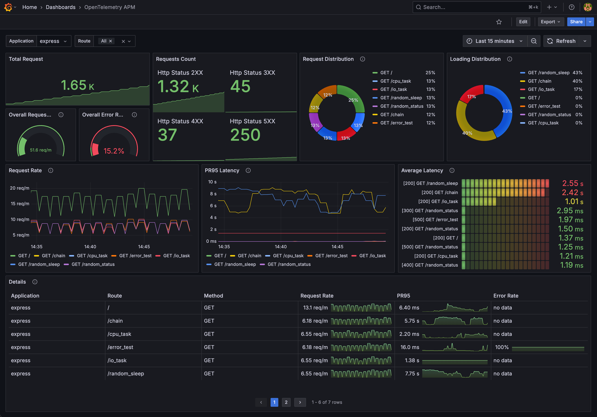

# OpenTelemetry Application Performance Management

Monitoring application performance with OpenTelemetry Collector and Grafana:

1. Generate traces and push them to OpenTelemetry Collector with OpenTelemetry automatic instrumentation
2. Process traces to metrics with OpenTelemetry Collector's [Span Metrics Connector](https://github.com/open-telemetry/opentelemetry-collector-contrib/blob/main/connector/spanmetricsconnector/README.md)
3. Collect metrics with Prometheus
4. Query metrics with Grafana

TODO: Add a diagram

This project is inspired by [Jaeger Service Performance Monitoring](https://www.jaegertracing.io/docs/1.47/spm/).

## Quick Start

1. Build application image and start all services with docker-compose

   ```bash
   docker-compose build
   docker-compose up -d
   ```

   This demo includes Spring Boot(Java), FastAPI(Python), (PHP), (Ruby), (JavaScript), and (.NET) to demonstrate OpenTelemetry automatic instrumentation. Comment out the services you don't want to run in `docker-compose.yml`.

2. Send requests with [siege](https://linux.die.net/man/1/siege) and curl to the applications

   ```bash
   bash request-script.sh
   ```

   Or you can send requests with k6:

   ```bash
    k6 run --vus 10 --duration 30s k6-script.js
    ```

3. Check predefined dashboard `FastAPI Observability` on Grafana [http://localhost:3000/](http://localhost:3000/)

   Dashboard screenshot:

   

   The dashboard is also available on [Grafana Dashboards](https://grafana.com/grafana/dashboards/16110).

## Detail

### OpenTelemetry Automatic Instrumentation

TODO: multiple languages

#### Spring Boot Java

#### FastAPI Python

```bash
opentelemetry-instrument \
    --traces_exporter otlp \
    --metrics_exporter none \
    --service_name test \
    --exporter_otlp_endpoint http://0.0.0.0:63996 \
    python main.py
```

### OpenTelemetry Collector

Contrib version is required for Span Metrics Connector

### Tempo

### Grafana

[Sparkline feature](https://grafana.com/docs/grafana/latest/panels-visualizations/visualizations/table/#sparkline)

## Reference

1. [The RED Method: key metrics for microservices architecture](https://www.weave.works/blog/the-red-method-key-metrics-for-microservices-architecture/)
